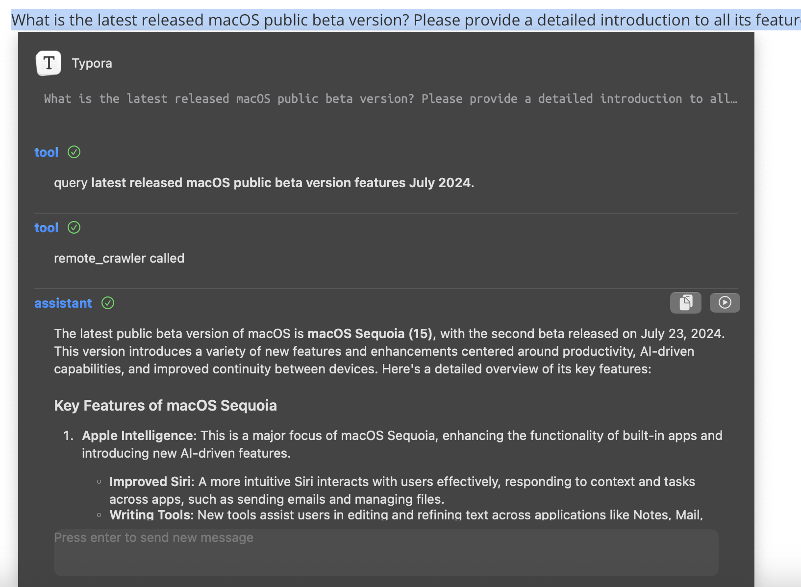

AIChat is an extension for communicating with AI, allowing users to directly inquire OpenAI or Gemini's GPT by selecting text.

Support five function callings:
1. Online search.
2. Get the current weather in a given location.
3. Get the content of a specified url.
4. Extract specific text content from the current web page when it's in Chrome.
5. Run python or bash script on macOS to do some tasks, such as reading files on macOS or getting ip address.

